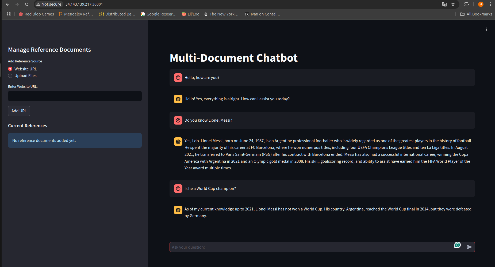
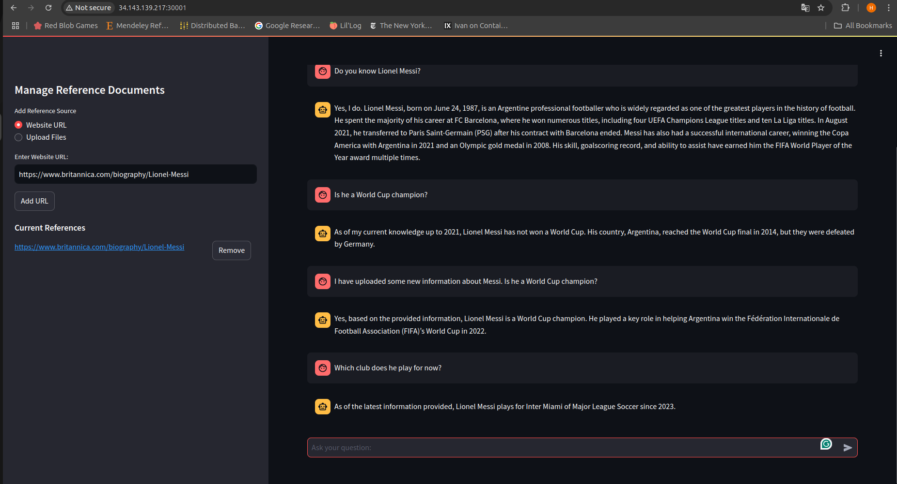
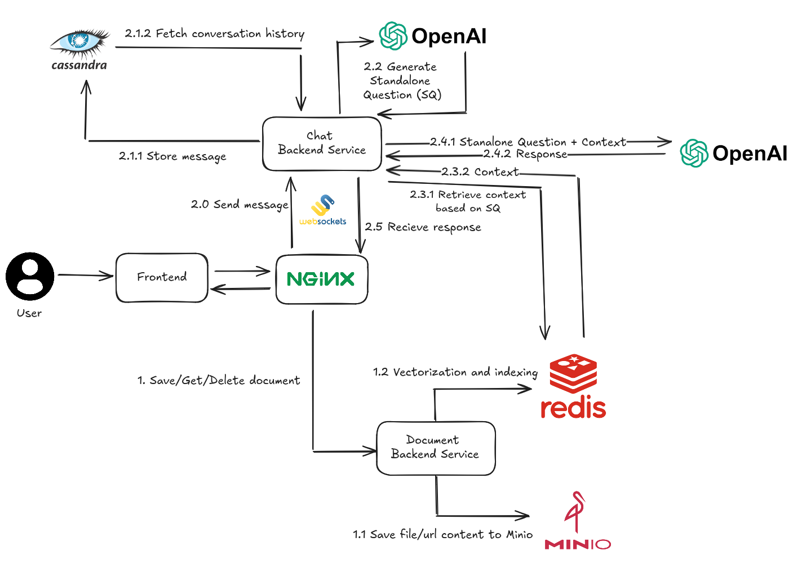
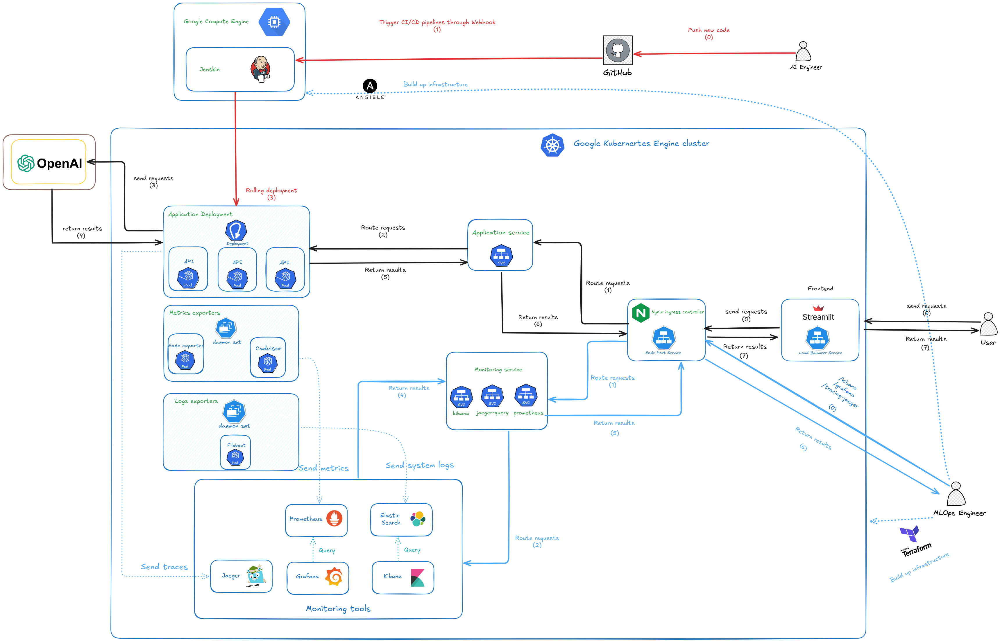
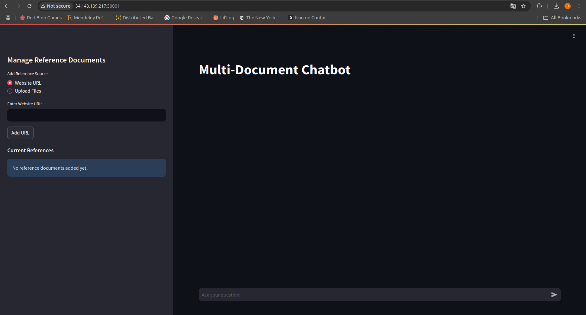
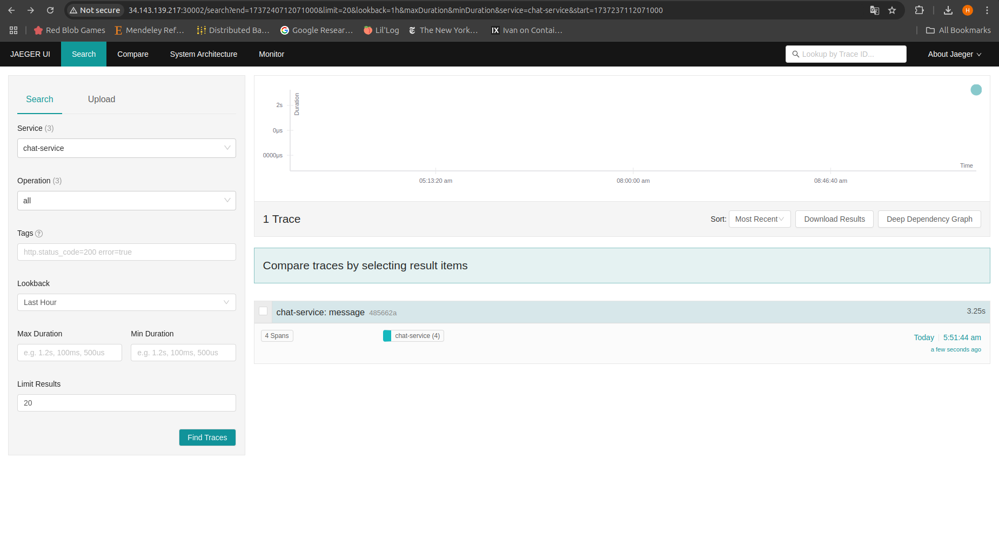
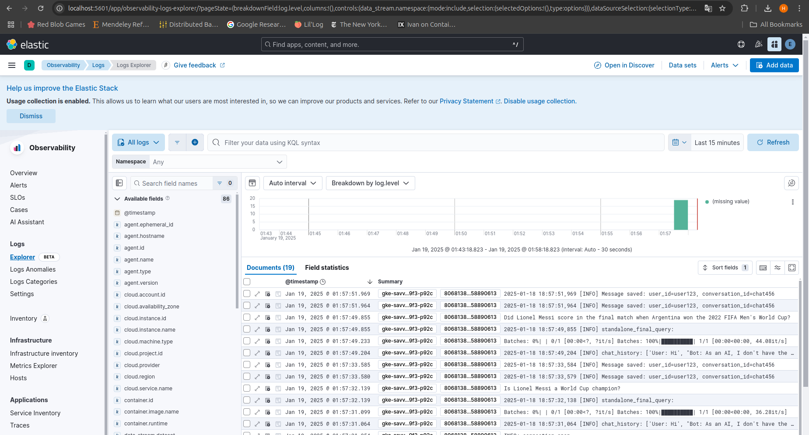
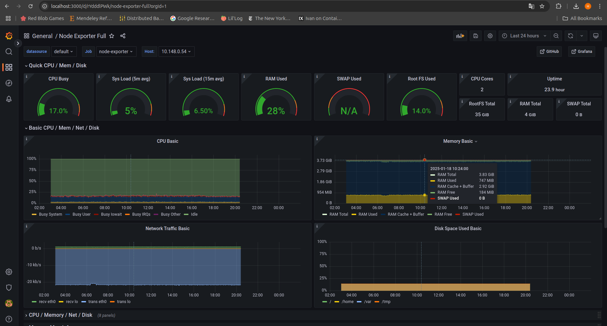

# 🤖 Chat With Your Documents: Stateful AI Chatbot

Welcome to **Chat With Your Documents**, an advanced stateful chatbot application designed to streamline document-based interactions. This application enables users to upload files 📁 or provide URLs 🌐 and engage in dynamic, context-aware conversations directly with their documents. Whether you're querying technical documentation, analyzing reports, or diving deep into research papers, this chatbot makes it effortless to extract insights and knowledge.

## ✨ Key Features

- **🤝 Stateful Conversations**: Maintain the context of your queries for more intelligent and coherent interactions.
- **📄 Retrieval-Augmented Generation System**: Seamlessly upload files or provide URLs to enable dynamic, context-aware conversations with your documents by leveraging retrieval-augmented generation techniques.
- **🚀 Google Kubernetes Deployment**: Deployed seamlessly on Google Kubernetes Engine (GKE) for scalable and robust operations.
- **🔄 CI/CD Integration**: Equipped with a Continuous Integration and Continuous Deployment (CI/CD) pipeline to ensure fast, reliable updates and maintenance. *(In progress...)*

This repository contains all the resources you need to deploy, customize, and use the application effectively. Dive into the sections below to get started! 🚀

## 🌟 Demo

<p align="center">
  
</p>
<p align="center">
  <strong>Figure 1.</strong> Frontend.
</p>

<p align="center">
  
</p>
<p align="center">
  <strong>Figure 1.</strong> Frontend.
</p>


## 🌟 System Overview

<p align="center">
  
</p>
<p align="center">
  <strong>Figure 1.</strong> Frontend.
</p>

---

### 📄 RAG - System

- **Document Upload**: 🗂️ Users can upload their documents (including files or URLs) to the chatbot. The content from these files or URLs is saved in **MinIO** for further processing.
  
- **Vectorization**:
  - **🔍 Semantic Chunking**: Documents are split into smaller, meaningful chunks using semantic chunking techniques. Semantic chunking ensures that each segment of the document preserves contextual relevance, making it easier to retrieve and understand. For example, sections, paragraphs, or logical groupings of information are treated as distinct chunks.
  - **📦 Embedding and Storage**: Each chunk is converted into embeddings (vector representations) and stored in **Redis Vector Database** for efficient similarity-based retrieval during queries.

---

### 💬 Chat System

- **User Session**:
  - **🔗 Stateful Connection**: A WebSocket connection is established between the user and the server to maintain a stateful session.
  - **📜 Historical Context**: At the start of the session, historical conversation data is fetched from **Cassandra** to provide the chatbot with contextual knowledge of past interactions. This allows the chatbot to respond more effectively by considering previous queries and answers.
  - **📈 Incremental Updates**: WebSockets enable real-time, incremental updates to the historical conversation data, ensuring the context is always up-to-date.

- **Message Processing**:
  - **🛠️ Standalone Question Creation**: Each user message, along with its historical context, is processed to generate a **standalone question** using OpenAI. The standalone question is reformulated to be independent of previous interactions, improving both context retrieval and input clarity for the LLM.
  - **Example**:
    ```
    User: Do you know Elon Musk?
    Bot: Yes, I know him.
    User: Is HE the richest man in the world?
    ```
    **Standalone Question**: *Is Elon Musk the richest man in the world?*

- **📚 Context Retrieval**:
  - The embedding of the standalone question is used to query the **Redis Vector Database**, retrieving relevant chunks of external context.

- **🧠 Response Generation**:
  - The standalone question and the retrieved context are sent to the **OpenAI API** to generate a response.
  - The user’s question and the chatbot's response are then stored in **Cassandra** to update the conversation history.

This system architecture ensures accurate, context-aware responses and efficient handling of document-based queries. 🚀

---

## 🚀 Getting Started

Follow these steps to set up and run the application:

1. **Clone the repository**:
   ```bash
   git clone https://github.com/nhduong1203/LLM-Chatbot
   ```

2. **Navigate to the project directory**:
   ```bash
   cd LLM-Chatbot
   ```

3. **Set the root directory environment variable** (for easier navigation):
   ```bash
   export ROOT_DIR=$(pwd)
   ```

---

## 🚀 Application Deployment

<p align="center">
  
</p>
<p align="center">
  <strong>Figure 1.</strong> Frontend.
</p>

### 1.1 Build Application Image

1. Create a new `.env` file based on `.env.example` and populate the variables there:
   ```bash
   cd $ROOT_DIR
   set -a && source .env && set +a
   ```

2. Build the application images:
   ```bash
   docker-compose build --no-cache
   ```

3. After building the images, tag and push the image to your Docker Hub repository. For example:
   ```bash
   docker tag backend-chat:latest $DOCKER_USERNAME/backend-chat:latest
   docker push $DOCKER_USERNAME/backend-chat:latest
   ```

---

### 1.2 Deploy to GKE

#### 1.2.1 Setup

1. **Install Required Tools**:
   - [kubectl](https://kubernetes.io/docs/tasks/tools/install-kubectl/) - For communicating with the Kubernetes API server.
   - [kubectx and kubens](https://github.com/ahmetb/kubectx) - For easier navigation between clusters and namespaces.
   - [Helm](https://helm.sh/docs/intro/install/) - For managing templating and deployment of Kubernetes resources.

2. **Create a GKE Cluster using Terraform**:
   - Log in to the GCP Console and create a new project.
   - Update the `project_id` in `terraform/variables.tf`:
     ```hcl
     variable "project_id" {
       description = "The project ID to host the cluster in"
       default     = "your-project-id"
     }

     variable "region" {
       description = "The region for the cluster"
       default     = "asia-southeast1-a"
     }
     ```

3. **Log in to GCP using the gcloud CLI**:
   ```bash
   gcloud auth application-default login
   ```

4. **Provision a new GKE cluster using Terraform**:
   ```bash
   cd $ROOT_DIR/iac/terraform
   terraform init
   terraform plan
   terraform apply
   ```

5. **Connect to the GKE Cluster**:
   ```bash
   gcloud container clusters get-credentials $CLUSTER_NAME --region $REGION --project $PROJECT_ID
   ```

6. **Switch to the GKE Cluster Context**:
   ```bash
   kubectx gke_${PROJECT_ID}_${REGION}_${CLUSTER_NAME}
   ```

---

#### 1.2.2 Deployment

1. Navigate to the `k8s-yaml` folder:
   ```bash
   cd $ROOT_DIR/k8s-yaml
   ```

2. Deploy each service by applying its corresponding YAML file. For example:
   ```bash
   cd db
   kubectl apply -f minio.yaml
   ```

3. Repeat the process for all other services in their respective folders by navigating to the folder and running:
   ```bash
   kubectl apply -f {service-name}.yaml
   ```

4. Create a Secret: store the OpenAI API key in a Kubernetes secret:
    ```bash
    kubectl create secret generic openai-api-key --from-literal=OPENAI_API_KEY=<your_openai_api_key>
    ```
**Note:** To deploy Cassandra, first run `cassandra-deployment.yaml` to start Cassandra. Then, run `cassandra-init-job.yaml` to initialize the keyspace, tables, and other required configurations.

---

## 📄 Instances in My GKE Cluster

Due to the limitations of GCP's free trial tier, I am unable to use instances with GPUs. As a result, certain machine learning models in this cluster will run on CPU. Below is the configuration of the instances in my cluster:

| **Resource**                     | **Name**                           | **Machine Type** | **Disk Size (GB)** | **Preemptible** | **Labels**               | **Min Nodes** | **Max Nodes** | **Node Count** | **Workload**           |
| -------------------------------- | ---------------------------------- | ---------------- | ------------------ | --------------- | ------------------------ | ------------- | ------------- | -------------- | ---------------------- |
| **GKE Cluster**                  | `${var.project_id}-gke`            | N/A              | N/A                | N/A             | N/A                      | N/A           | N/A           | 1              | Cluster Management     |
| **System Services Node Pool**    | `${var.project_id}-sys-svc-pool`   | e2-standard-2    | 40                 | No              | workload=system-services | 1             | 3             | 1              | MinIO and Redis        |
| **Cassandra Node Pool**          | `${var.project_id}-cassandra-pool` | e2-highmem-4     | 40                 | No              | workload=cassandra       | 1             | 2             | 1              | Cassandra Database     |
| **Backend Doc Node Pool**        | `${var.project_id}-doc-pool`       | e2-standard-4    | 40                 | No              | workload=backend-doc     | 1             | 2             | 1              | Backend Doc Management |
| **Backend Chat Node Pool**       | `${var.project_id}-chat-pool`      | e2-standard-4    | 40                 | No              | workload=backend-chat    | 1             | 2             | 1              | Backend Chat Service   |
| **Frontend and NGINX Node Pool** | `${var.project_id}-fe-pool`        | e2-medium        | 40                 | Yes             | workload=frontend        | 1             | 1             | 1              | Frontend & NGINX       |

This completes the setup and deployment of the chatbot application on GKE. 🎉
With NodePort Service, you can access the frontend from the external IP of a node.
<p align="center">
  
</p>
<p align="center">
  <strong>Figure 1.</strong> Frontend.
</p>

## Observability

So far, we have deployed the model and the FastAPI app to GKE. Now, we need to monitor the performance of the model and the app. We will use Prometheus and Grafana for monitoring the model and the app, Jaeger for tracing the requests, and Elasticsearch and Kibana for collecting system logs. Let's get started!

1. Increase inotify watch limits for Kubernetes instances.
    
    ```shell
    cd $ROOT_DIR/observability/inotify
    kubectl apply -f inotify-limits.yaml
    ```
    
2. Create a separate namespace for observability and switch to it.

    ```shell
    kubectl create namespace observability
    kubens observability
    ```

3. Install Jaeger for tracing the application.

    ```shell
    cd $ROOT_DIR/k8s-yaml
    kubectl apply -f jaeger.yaml
    ```

4. Install the ELK stack for collecting logs.

    ```shell
    # Install ECK operator
    cd $ROOT_DIR/observability/elasticcloud/deploy/eck-operator
    kubectl delete -f https://download.elastic.co/downloads/eck/2.13.0/crds.yaml
    kubectl create -f https://download.elastic.co/downloads/eck/2.13.0/crds.yaml
    kubectl apply -f https://download.elastic.co/downloads/eck/2.13.0/operator.yaml
    # Install ELK stack
    cd $ROOT_DIR/observability/elasticcloud/deploy/eck-stack
    kubectl get serviceaccount filebeat -n elk &> /dev/null && kubectl delete serviceaccount filebeat -n elk || true
    kubectl get clusterrolebinding filebeat -n elk &> /dev/null && kubectl delete clusterrolebinding filebeat -n elk || true
    kubectl get clusterrole filebeat -n elk &> /dev/null && kubectl delete clusterrole filebeat -n elk || true
    helm upgrade --install elk -f values.yaml .
    ```

5. Install Prometheus and Grafana for monitoring the system.

    ```shell
    cd $ROOT_DIR/observability/metric
    yq e '.data."config.yml" |= sub("webhook_url: .*", "webhook_url: env(DISCORD_WEBHOOK_URL)")' -i charts/alertmanager/templates/configmap.yaml 
    helm upgrade --install prom-graf . --namespace observability
    ```

6. Access the monitoring tools:

   6.1. **Jaeger**:
   - Forward port:
   ```shell
   nohup kubectl port-forward svc/jaeger-query 16686:80 > port-forward.log 2>&1 &
   ```
   - Access via: [http://localhost:16686](http://localhost:16686) or node's external-IP
<p align="center">
  
</p>
<p align="center">
  <strong>Figure 1.</strong> Frontend.
</p>

   6.2. **Kibana**:
   - Forward port:
    ```shell
    nohup kubectl port-forward -n observability svc/elk-eck-kibana-kb-http 5601:5601 > /dev/null 2>&1 &
    ```
   - Access Kibana at: [http://localhost:5601](http://localhost:5601)
   - Get the password for the `elastic` user:
     ```shell
     kubectl get secret elasticsearch-es-elastic-user -n observability -o jsonpath='{.data.elastic}' | base64 -d
     ```
<p align="center">
  
</p>
<p align="center">
  <strong>Figure 1.</strong> Frontend.
</p>


   6.3. **Grafana**:
   - Forward port:
     ```shell
     nohup kubectl port-forward -n observability svc/grafana 3000:3000 > /dev/null 2>&1 &
     ```
   - Access Grafana at: [http://localhost:3000](http://localhost:3000)
   - Login with:
     ```
     username: admin
     password: admin
     ```
   - Check for metrics.
<p align="center">
  
</p>
<p align="center">
  <strong>Figure 1.</strong> Frontend.
</p>

